# How to Setup LiveSplit for AutoSplit

# Table of contents
1. [Go to github and download](#VdcgRwN8P676zRubXPYus)\
2. [Click newest release](#0nQpC1KO2rnD_th1vxzVa)\
3. [Click either zip](#PcvxOqY5L6C7YGV_k6Gut)\
4. [Click "Save As..." or "Save"](#io6NxDJKUuaCM5ZDDKw8O)\
5. [Open location of the extracted file](#z_M3oehRrgePWT_aM-WWI)\
6. [Extract it](#03PtRR_-x-hLNLBU45hB1)\
7. [Download autosplit compentent for livesplit](#zYL9HI_xhAl8Nb2AS6wGy)\
8. [Click "here"](#45nV3-8Sv90L1ugA3X8Z9)\
9. [Click "Save As..."](#lBHXo7fXLt-9KmqsC6Om4)\
10. [Click "Livesplit"](#IsOQhuyy9sv7WiGti9FCr)\
11. [Click "Components"](#m5dx4R4uUlyl6cfBERPd-)\
12. [Open Livesplit](#COO3ZkvcMeB5ov6KpTsIh)\
13. [Right click](#H7oALo-d820uhBOIgXjij)\
14. [Click "Edit Layout..."](#T-tEoIl-mR54gpe57NxR_)\
15. [Click "plus"](#x3NZtH3Ll_KeLZ7QAMZ24)\
16. [Click "Control"](#0IZaGWt678fxx47m2PAXh)\
17. [Click "AutoSplit Integration"](#9GzUhWHvIPFYHdkgnrmYA)\
18. [Click "Layout Settings"](#2fvR4Nqub-ik91PTUeqUo)\
19. [Click "AutoSplit Integration"](#bptGFsSeWXnaO_e45Rgah)\
20. [Click "Browse..."](#ULtuqOJKJRxwPxfu_BF-8)\
21. [Click "Autosplit.exe"](#-hG4l90CBQxvB-TGarJsl)\
22. [Click "Open"](#_D85z8kr0yfDlkHhs-PdJ)\
23. [Click "Browse..."](#3a6V6TnX1grEf3gO-Snst)\
24. [Click "Settings"](#hLO2z8003AqsXcTOJ6mzF)\
25. [Click "Open"](#IHb4--QWuRMlZxo2-4sou)\
26. [Click "OK"](#l2auULkV7vyOw_Dvq7f8M)\
27. [Click "OK"](#i2R82MLSSZtxocFy55pQQ)\
28. [Click "Save Layout As..."](#v9aqFfn1U66h-DNRhfyfg)\

### 1. Go to github and download  
[https://github.com/Toufool/AutoSplit](https://github.com/Toufool/AutoSplit)

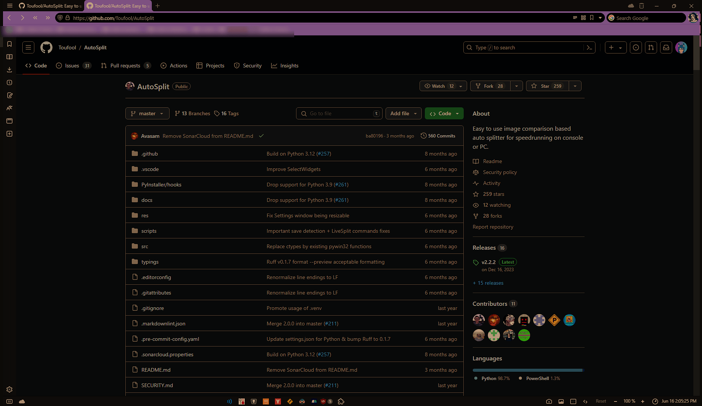

### 2. Click newest release  

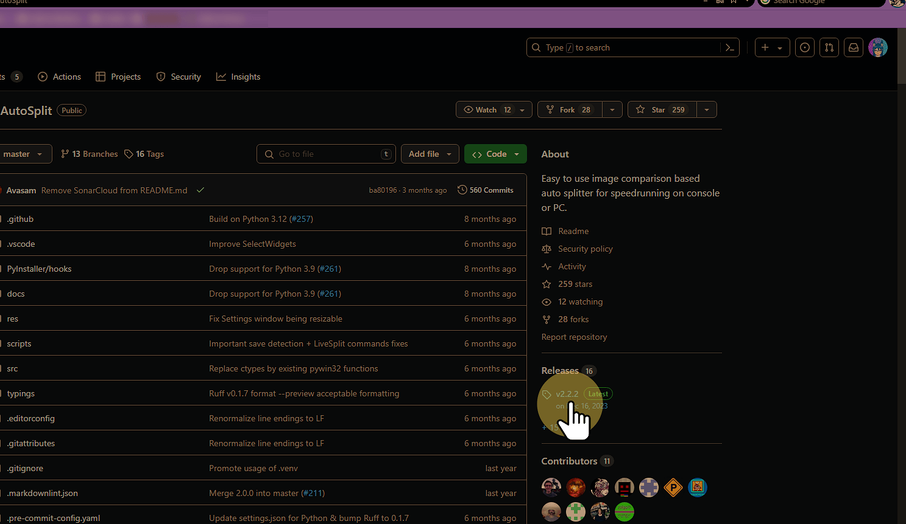

### 3. Click either zip  

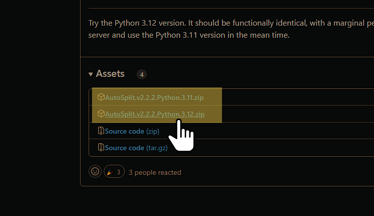

### 4. Click "Save As..." or "Save"  

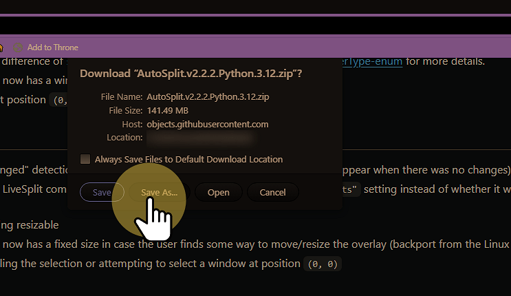

### 5. Open location of the extracted file  

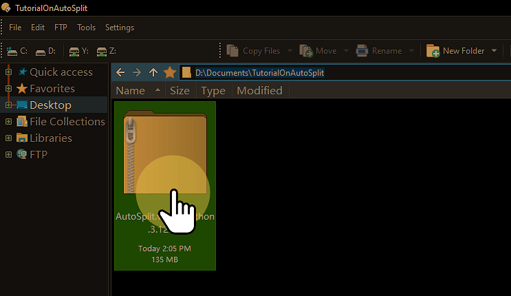

### 6. Extract it  

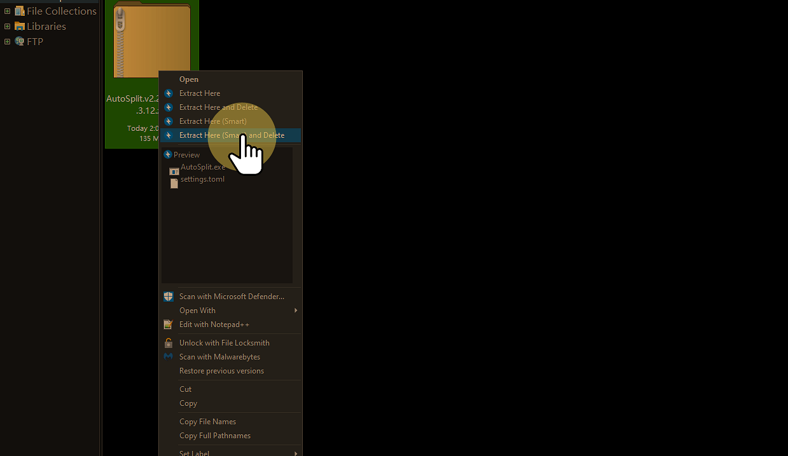

### 7. Download autosplit compentent for livesplit  
[https://github.com/Toufool/AutoSplit?tab=readme-ov-file#livesplit-integration-tutorial](https://github.com/Toufool/AutoSplit?tab=readme-ov-file#livesplit-integration-tutorial)

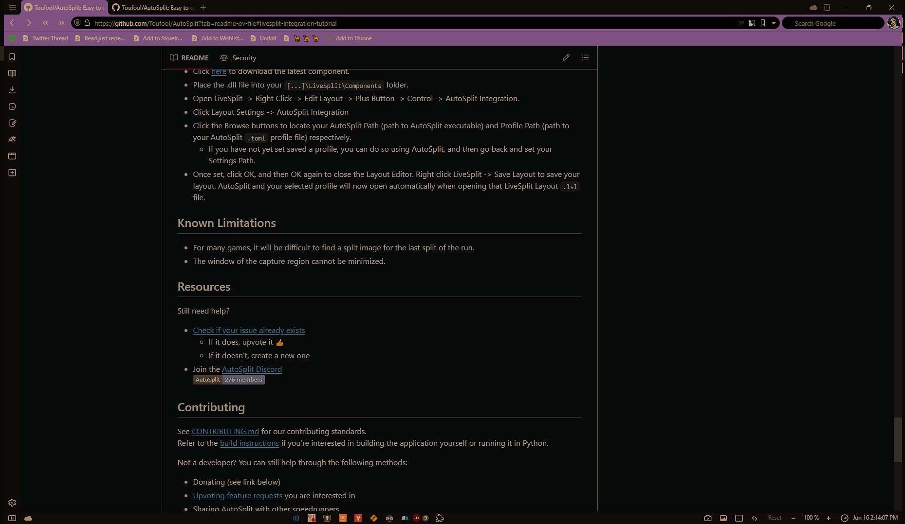

### 8. Click "here"  

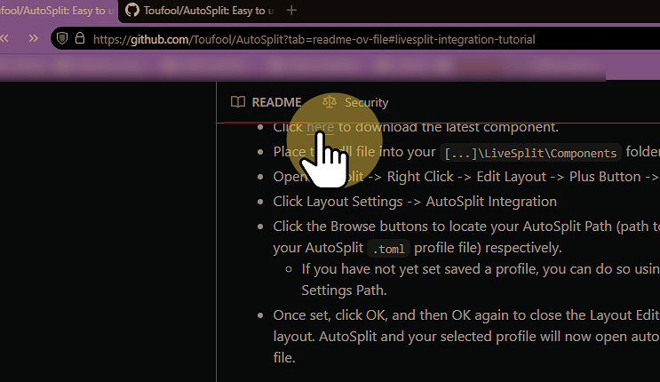

### 9. Click "Save As..."  

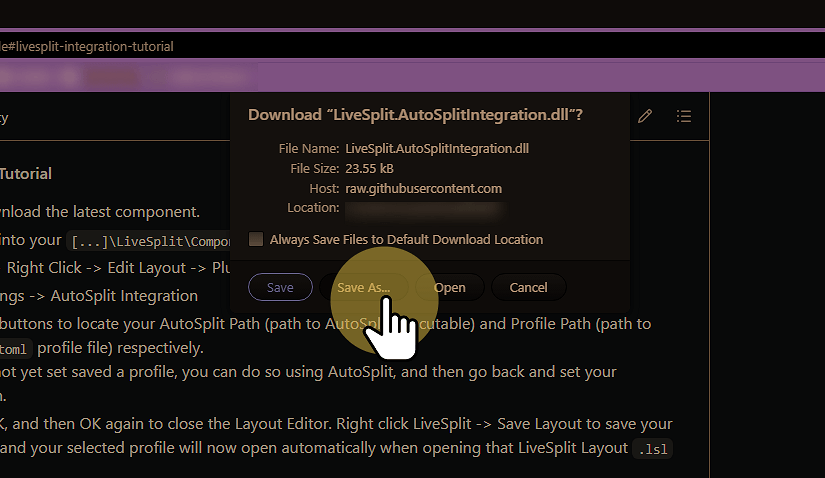

### 10. Click "Livesplit"  

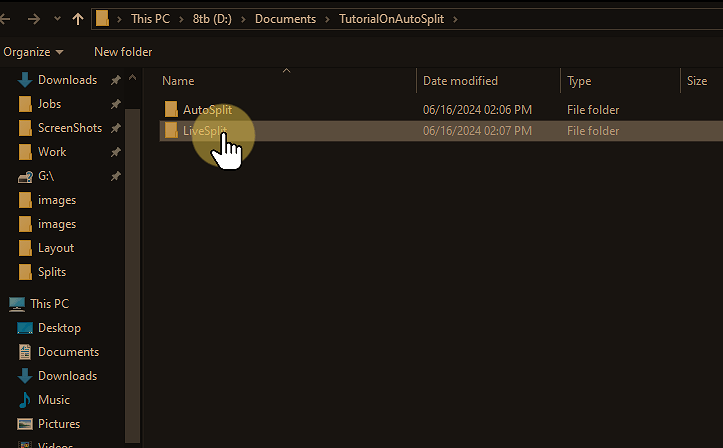

### 11. Click "Components"  

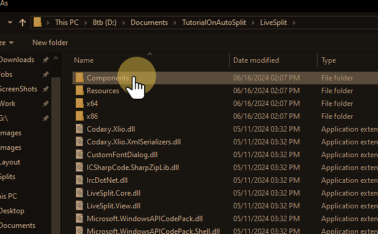

### 12. Open Livesplit  

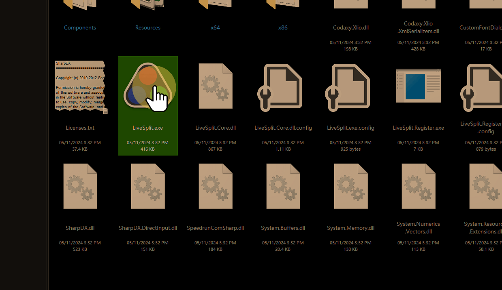

### 13. Right click  

### 14. Click "Edit Layout..."  

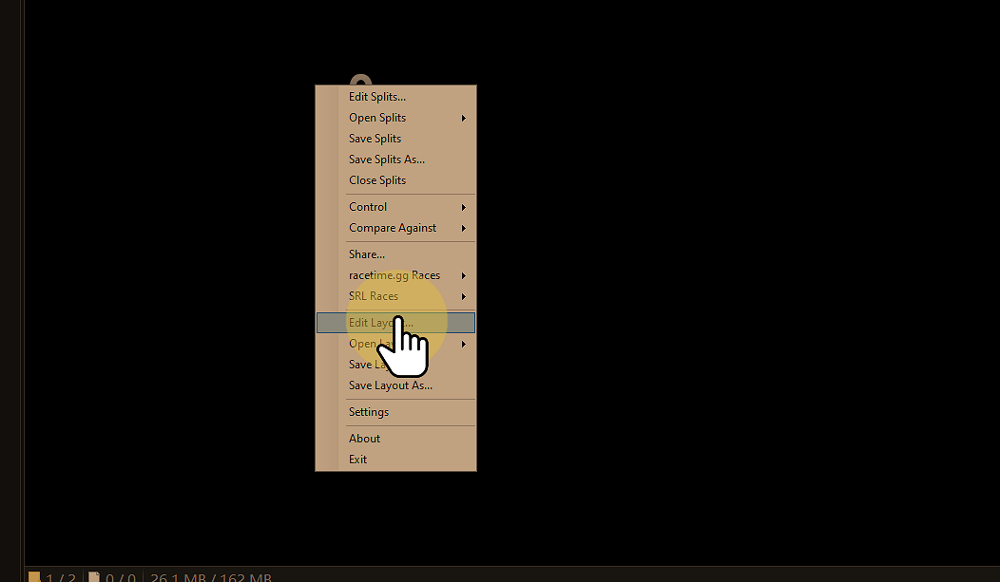

### 15. Click "plus"  

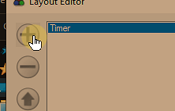

### 16. Click "Control"  

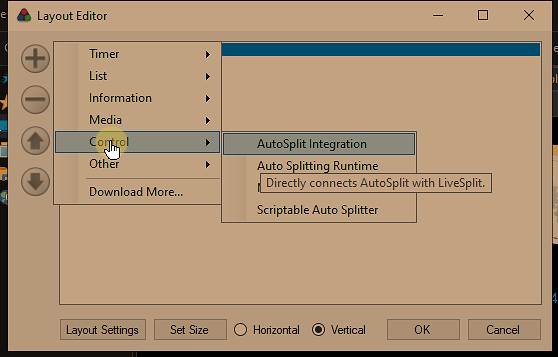

### 17. Click "AutoSplit Integration"  

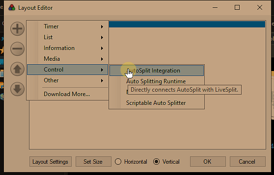

### 18. Click "Layout Settings"  

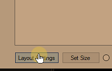

### 19. Click "AutoSplit Integration"  

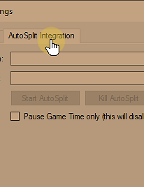

### 20. Click "Browse..."  

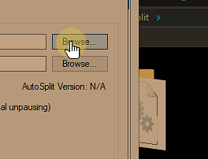

### 21. Click "Autosplit.exe"  
to prevent crashes do not have autosplit previously open or the game

(Just for this step)

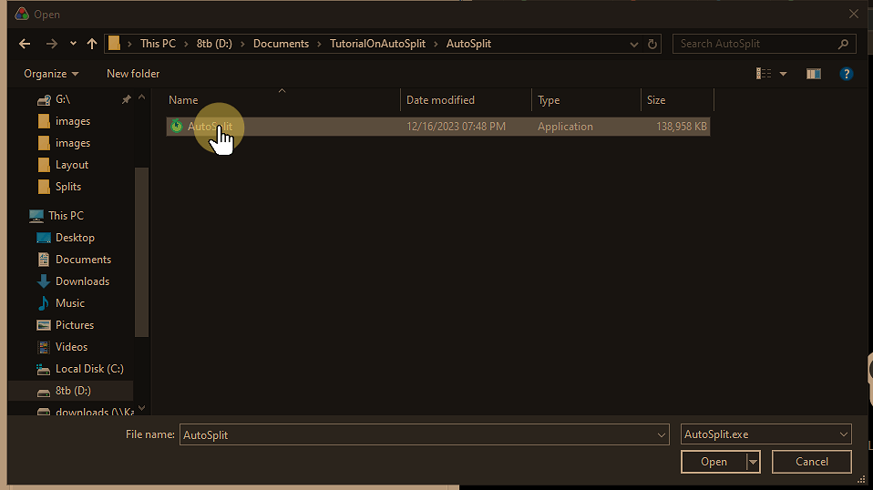

### 22. Click "Open"  

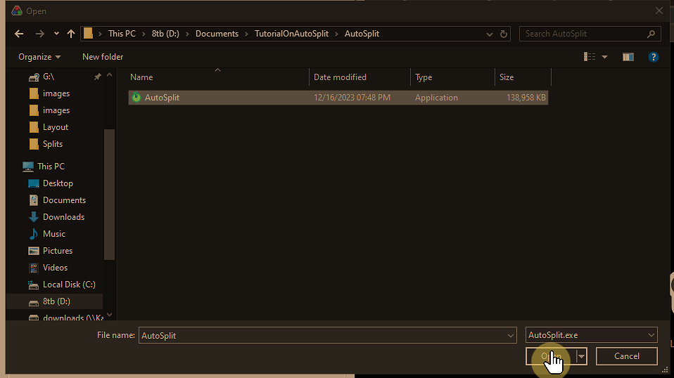

### 23. Click "Browse..."  

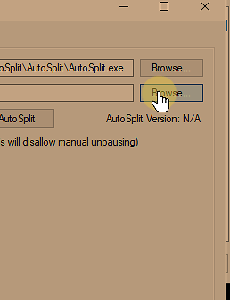

### 24. Click "Settings"  
The settings are per image folder (If want to autoload since setting save images folder location)

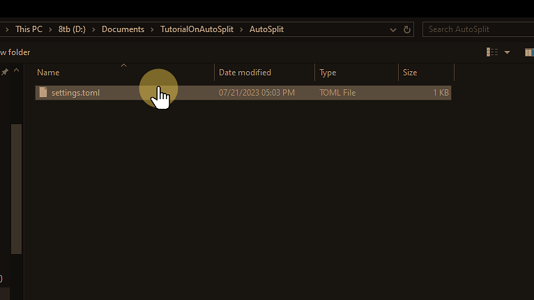

### 25. Click "Open"  

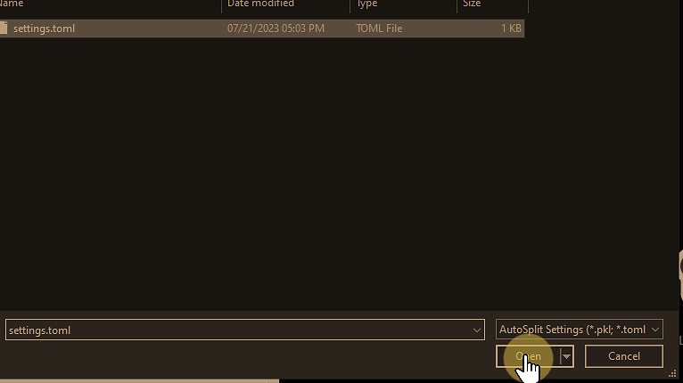

### 26. Click "OK"  

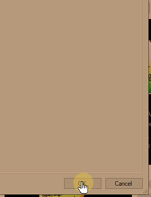

### 27. Click "OK"  

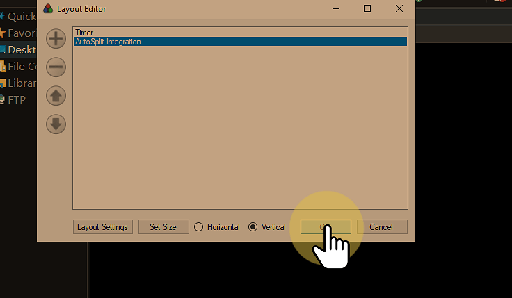

### 28. Click "Save Layout As..."  
*Make sure do this step otherwise you will have to link it each time

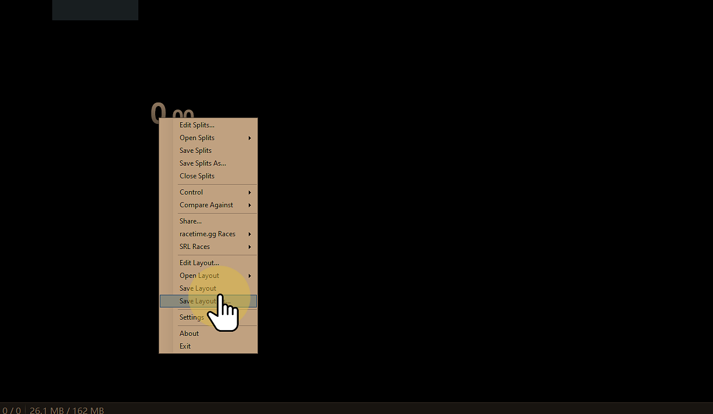
