# How to setup AutoSplit

# Table of contents
1. [Go to github page](#2NGTMW_g70veoBXn0e6jU)\
2. [Click "Images for Autosplit"](#MNy0WP4htLLJAGjPFxUpL)\
3. [Click "scooby-doo.unmasked.any.withloads.zip"](#Q7R6gORN11108N2whInl4)\
4. [Click "Save As..."](#Xwt84CE4hmcSNWyMZ-sA2)\
5. [Click "Save"](#VxkPUIRD0Vl1NuOLWgb6O)\
6. [Extract Zip](#it8nx7ymuAdusR_H3lKvF)\
7. [Open "AutoSplit"](#EFPuN_k94RN2d_dtf02ZT)\
8. [Click "File"](#QghuwAnp-Zc99AUQKYGfn)\
9. [Click "Settings"](#IiUkjtjcJjxgLYAllfxys)\
10. [Click "Hotkeys"](#StIJS_wMFRSevl92LySKt)\
10.1. [Click "Set Hotkey"](#V61HLgc11AYnmdsBbib8O)\
10.2. [Click "Set Hotkey"](#rVlQkQOXU7k7lnUfYpep6)\
10.3. [Click "Set Hotkey"](#16YtpIdg3-9LJKwH1vVDb)\
10.4. [Click "Set Hotkey"](#q2FsHopN16s51sH4h0v9W)\
10.5. [Click "Set Hotkey"](#S8oZe3squNdqQaIGRm0yV)\
10.6. [Click "X"](#NKdXgXuAtF0iDHBsMh7hp)\
11. [Click "Browse..."](#Jb-aHl9FH1PKlXV6rRb9a)\
12. [Click extract image folder](#e06UxdoOBIAJULG00W3jp)\
13. [Click "Select Folder"](#LY7l9TH-BZ-6kJ5cKC4TV)\
14. [Click "Select Window"](#Bokm6hacopWqRvhaBKpnj)\
15. [Click Application/Game you want autosplit to use](#-bdR6MeVU2zKSaL60CJnw)\
16. [Click "Align Region"](#vIKvr5VHgY3TFIJyTEEWq)\
17. [Click "image"](#m1N3zQsYNE7AWVIGvMmB8)\
18. [Click "Open"](#Y4eKGYXYQkf2fVa2hZ9IQ)\
19. [Click "Reload Start Image"](#b46Mct5Tt_HDcmjr5nj2m)\
20. [Click "File"](#7VYyKdUjQNnsdBryS2f4n)\
21. [Click "Save Profile"](#NRmQBx84XWsnPu2LFufdb)\

### 1. Go to github page  
[https://github.com/Argenticle/scooby-doo-unmasked-any-withloads-](https://github.com/Argenticle/scooby-doo-unmasked-any-withloads-)

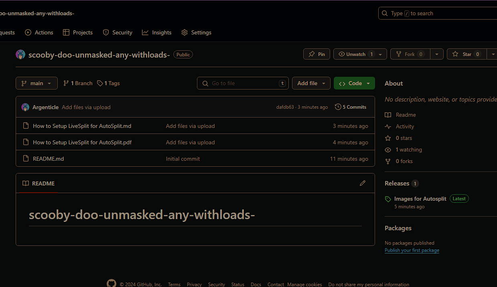

### 2. Click "Images for Autosplit"  

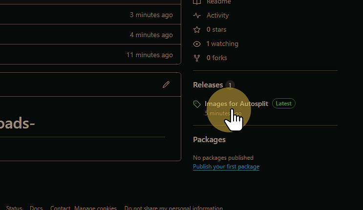

### 3. Click "scooby-doo.unmasked.any.withloads.zip"  

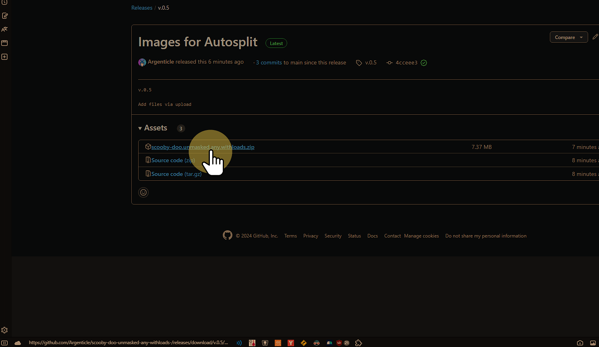

### 4. Click "Save As..."  

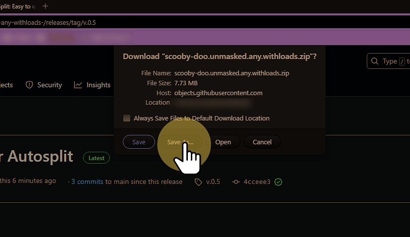

### 5. Click "Save"  

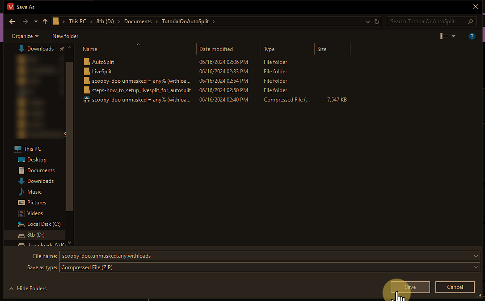

### 6. Extract Zip  

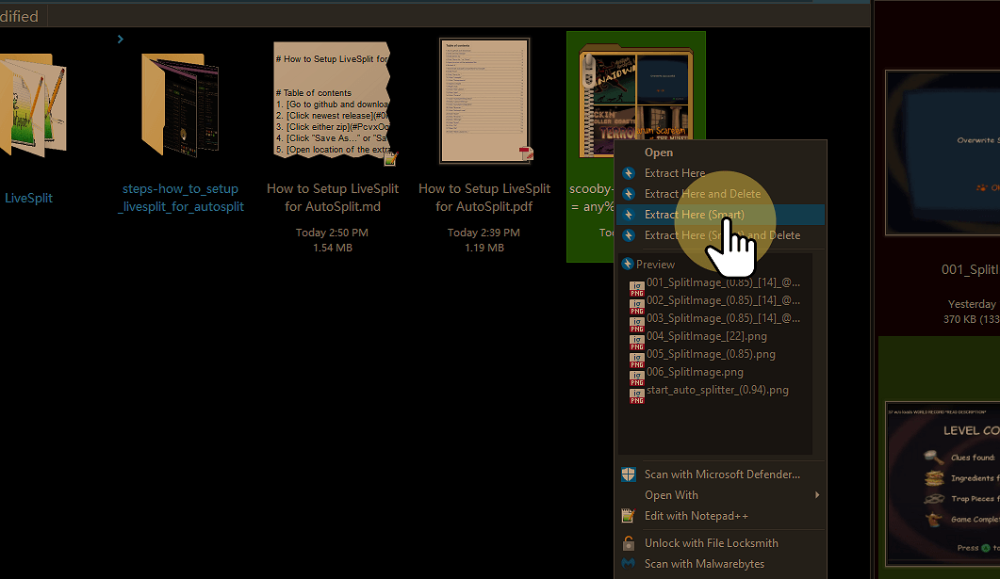

### 7. Open "AutoSplit"  

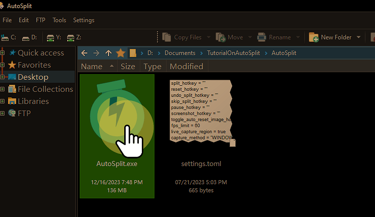

### 8. Click "File"  

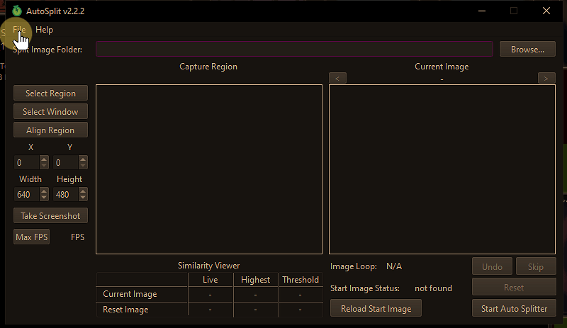

### 9. Click "Settings"  

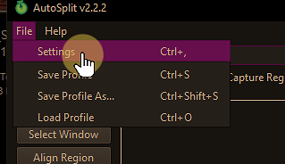

### 10. Click "Hotkeys"  
*Make sure this matches livesplit

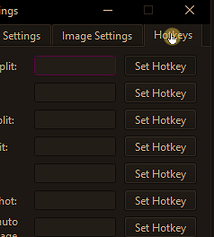

#### 10.1. Click "Set Hotkey"  

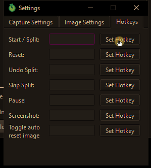

#### 10.2. Click "Set Hotkey"  

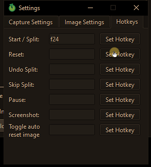

#### 10.3. Click "Set Hotkey"  

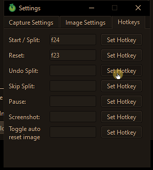

#### 10.4. Click "Set Hotkey"  

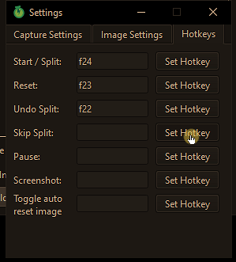

#### 10.5. Click "Set Hotkey"  

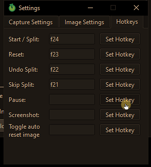

#### 10.6. Click "X"  

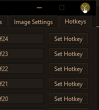

### 11. Click "Browse..."  

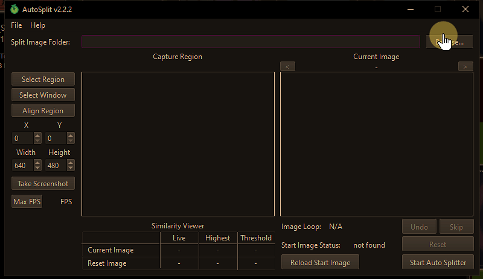

### 12. Click extract image folder  

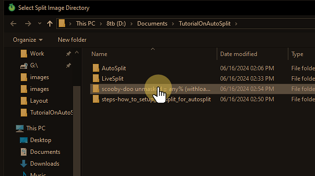

### 13. Click "Select Folder"  

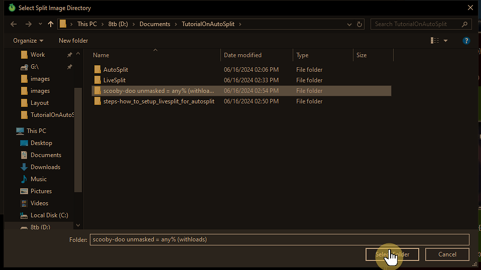

### 14. Click "Select Window"  

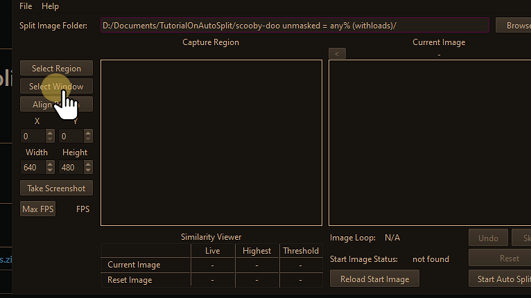

### 15. Click Application/Game you want autosplit to use  
*Video in screen [https://youtu.be/8n8bt43MQ2I](https://youtu.be/8n8bt43MQ2I)

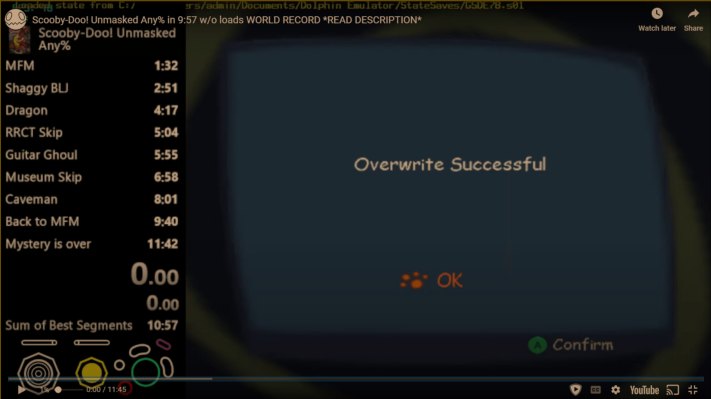

### 16. Click "Align Region"  

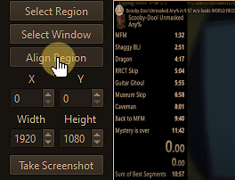

### 17. Click "image"  
*make sure this matches current frame of the game

Hint:Load screens are really good images to help align

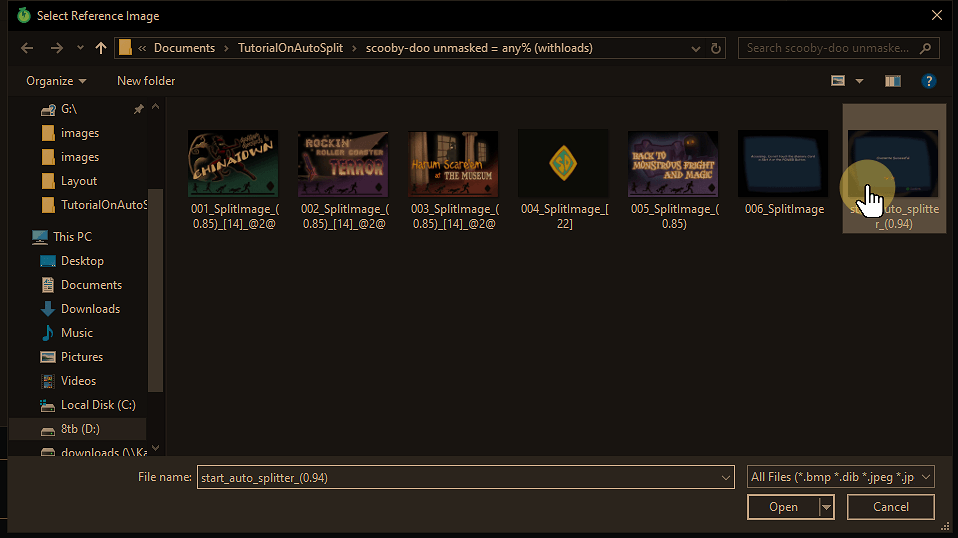

### 18. Click "Open"  

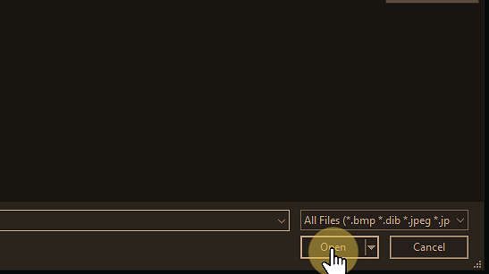

### 19. Click "Reload Start Image"  

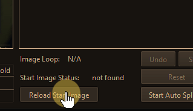

### 20. Click "File"  

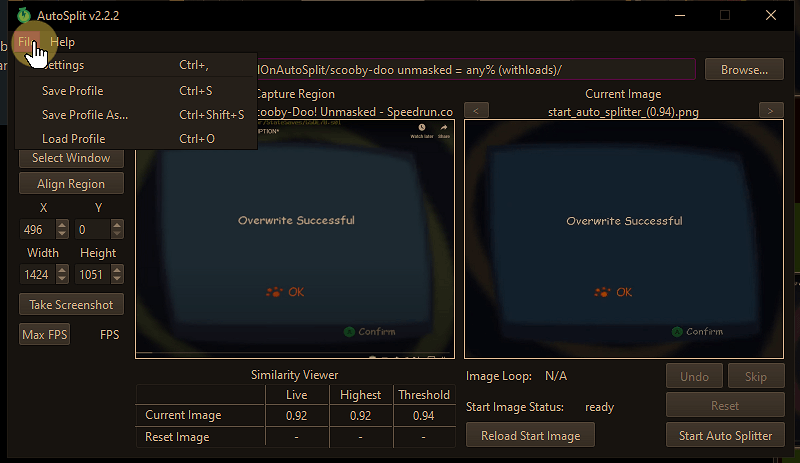

### 21. Click "Save Profile"  
*Make sure do this step otherwise you will have to repeat the guide

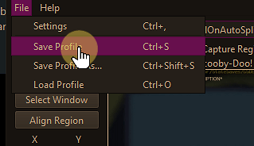

